# 数据库 ER 图

## 1. 文档概述

本项目以 `PostgreSQL` 作为核心持久化存储，用于保存竞品分析任务在执行过程中的关键数据，包括运行状态、事件日志、结构化证据、字段级分析结果、报告内容、问答记录、问卷结果以及返工信息。  
对本项目而言，数据库并不只是“把结果存下来”，而是承担了任务回放、过程追踪、报告修订、问卷导出和质量闭环支撑等职责。

本文件给出的是一份面向系统设计说明的核心 ER 图抽象，重点帮助读者理解这套系统如何组织过程数据和结果数据。

## 2. 设计思路

数据库建模主要围绕以下原则展开：

1. 以“运行任务”作为核心实体  
一次竞品分析任务对应一次完整运行，运行是所有阶段数据的聚合根。

2. 将“证据、分析、报告”拆分建模  
通过分层保存采集结果、中间分析产物和最终报告，支持可追溯分析链路。

3. 强化事件与可观测性记录  
将事件流、模型调用、检查点等能力独立建模，便于问题排查和运行回放。

4. 支持闭环修正与动态扩展  
通过返工单、Schema 提案等结构，支撑 QA 打回和动态 Schema 演化。

## 3. 核心 ER 图

```mermaid
erDiagram
    RUN ||--o{ RUN_EVENT : has
    RUN ||--o{ CHAT_TURN : has
    RUN ||--o{ EVIDENCE : has
    RUN ||--o{ FINDING : has
    RUN ||--o| REPORT : has
    RUN ||--o| QUESTIONNAIRE : has
    RUN ||--o{ REWORK_TICKET : has
    RUN ||--o{ LLM_CALL : has
    RUN ||--o{ CHECKPOINT : has
    RUN ||--o{ SCHEMA_PROPOSAL : has

    RUN {
        string run_id PK
        string status
        string task_summary
        datetime created_at
        datetime updated_at
    }

    RUN_EVENT {
        int event_id PK
        string run_id FK
        string event_type
        json payload
        datetime created_at
    }

    EVIDENCE {
        string evidence_id PK
        string run_id FK
        string competitor
        string schema_field
        string source_url
        string source_type
        string retrieval_method
        float confidence
        text content
    }

    FINDING {
        string finding_id PK
        string run_id FK
        string competitor
        string schema_field
        text summary
        float confidence
        json citations
    }

    REPORT {
        string run_id PK, FK
        text markdown
        datetime updated_at
    }

    CHAT_TURN {
        string turn_id PK
        string run_id FK
        string conversation_id
        string user_message
        text assistant_answer
        string status
        datetime created_at
    }

    QUESTIONNAIRE {
        string run_id PK, FK
        text markdown
        string export_url
        string export_provider
        datetime updated_at
    }

    REWORK_TICKET {
        string ticket_id PK
        string run_id FK
        string stage
        string reason
        json collect_plan
        string status
    }

    LLM_CALL {
        string call_id PK
        string run_id FK
        string stage
        string model
        int prompt_tokens
        int completion_tokens
        datetime created_at
    }

    CHECKPOINT {
        string checkpoint_id PK
        string run_id FK
        string stage
        json state_snapshot
        datetime created_at
    }

    SCHEMA_PROPOSAL {
        string proposal_id PK
        string run_id FK
        string industry
        json fields
        string status
    }
```

## 4. 核心实体说明

### 4.1 RUN：运行任务主实体

`RUN` 对应一次完整的竞品分析任务，是数据库中的核心实体。  
它记录任务的唯一标识、执行状态、任务摘要以及创建和更新时间。所有采集、分析、报告、问答与返工数据都围绕它展开。

### 4.2 RUN_EVENT：运行事件实体

`RUN_EVENT` 用于记录任务执行过程中的关键事件，例如阶段开始、阶段完成、工具调用、摘要更新和返工触发。  
该实体为系统的“可观测性”和“运行回放”能力提供基础支撑。

### 4.3 EVIDENCE：结构化证据实体

`EVIDENCE` 用于保存采集阶段沉淀下来的结构化证据。  
它不仅保存证据内容，还保存竞品归属、分析字段、来源链接、来源类型、获取方式和置信度，是后续字段级分析和证据追溯的直接依据。

### 4.4 FINDING：字段级分析实体

`FINDING` 用于保存围绕某一竞品、某一分析字段形成的结构化结论。  
每条分析结论都可关联到证据引用，因此可以用于横向比较、报告写作和 QA 审查。

### 4.5 REPORT：报告实体

`REPORT` 用于保存最终或阶段性生成的 Markdown 报告内容。  
该实体支持报告下载、报告修订和后续围绕报告继续发起对话。

### 4.6 CHAT_TURN：报告追问实体

`CHAT_TURN` 用于保存围绕报告发生的每一轮问答。  
它记录用户问题、系统回答、会话标识和执行状态，为持续修订和多轮对话能力提供支撑。

### 4.7 QUESTIONNAIRE：问卷实体

`QUESTIONNAIRE` 用于保存基于报告生成的调研问卷，包括问卷 Markdown 内容以及问卷导出后的链接信息。  
该实体使系统可以从“生成分析结论”进一步延伸到“验证分析结论”。

### 4.8 REWORK_TICKET：返工单实体

`REWORK_TICKET` 用于保存由 QA 审查触发的返工任务。  
它记录返工阶段、返工原因和补采计划，是系统自动闭环修正能力的重要体现。

### 4.9 LLM_CALL：模型调用实体

`LLM_CALL` 用于保存模型调用的阶段、模型名称和 Token 统计信息。  
它可以用于成本观测、性能分析和异常排查。

### 4.10 CHECKPOINT：检查点实体

`CHECKPOINT` 用于保存工作流关键阶段的状态快照。  
该设计能够支撑复杂长链路任务在返工、失败或恢复场景下的重建和回放。

### 4.11 SCHEMA_PROPOSAL：Schema 提案实体

`SCHEMA_PROPOSAL` 用于保存动态 Schema 演化过程中生成的字段提案。  
它使系统能够在保留核心分析框架的同时，根据行业特征和信息缺口扩展新的分析维度。

## 5. 实体之间的关系说明

### 5.1 一次运行对应多条过程数据

每个 `RUN` 可对应多条 `RUN_EVENT`、`EVIDENCE`、`FINDING`、`CHAT_TURN`、`LLM_CALL` 和 `CHECKPOINT`，这是因为一次竞品分析任务本身就是一个多阶段、多事件、多中间产物的过程。

### 5.2 一次运行对应唯一报告和问卷主实体

在常规场景下，一次运行最终会形成一份主报告，并在需要时形成一份与之对应的调研问卷，因此 `REPORT` 和 `QUESTIONNAIRE` 与 `RUN` 的关系更适合视作“一次运行对应一个主要结果实体”。

### 5.3 一次运行可对应多张返工单

由于 QA 检查可能多次触发返工，因此 `RUN` 与 `REWORK_TICKET` 是一对多关系。  
这使系统可以记录不同阶段、不同轮次的修正历史。

## 6. 设计特点总结

总体来看，本项目的数据库设计有以下特点：

- 以“运行任务”为中心，便于统一管理完整分析链路
- 将“证据、分析、报告”分层建模，支持结果可追溯
- 强调“事件、调用、检查点”的独立记录，支持回放与可观测
- 通过“返工单”和“Schema 提案”体现系统的闭环修正与动态扩展能力
- 同时支持最终结果展示和过程级审计，兼顾产品使用与工程管理需求
